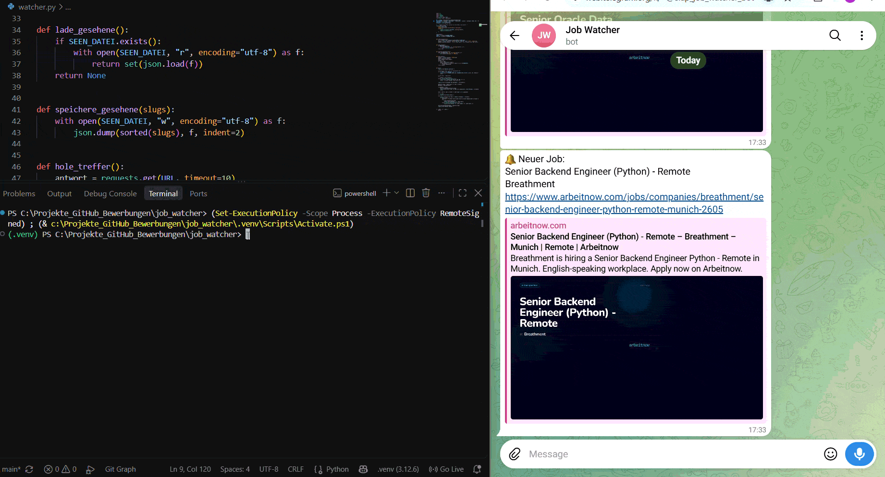

# Job Watcher


**A small Python automation that watches a job board and sends new matching postings straight to Telegram.**

I built Job Watcher to automate my own job search. Instead of refreshing a job board several times a day, the script checks it for me on a schedule, remembers what it has already seen, and pushes only the *new* matching jobs to my phone via a Telegram bot.

## Demo





## Features

- Fetches current job postings from the [Arbeitnow](https://www.arbeitnow.com) public job-board API.
- Filters postings by remote status and configurable title keywords.
- Remembers previously seen jobs, so you are only notified about new matches.
- Sends notifications through a Telegram bot.
- Keeps credentials out of the code using environment variables.
- Logs every run to both the console and a log file.
- Handles network and API errors gracefully instead of crashing.

## How it works

```
Arbeitnow API  ->  filter (remote + keywords)  ->  compare with seen.json
                                                          |
                                          new jobs?  ->  send to Telegram
                                                          |
                                              update seen.json + write log
```

1. The script requests the current job list from the API.
2. It keeps only postings that are remote and whose title contains one of the configured keywords.
3. It compares the matches against `seen.json`, a small file that stores the identifiers of jobs already reported.
4. On the very first run it saves the current matches silently (no flood of old jobs). On every later run it sends only genuinely new postings to Telegram.
5. It updates `seen.json` and records the run in `watcher.log`.

## Tech stack

- **Python** – core language
- **requests** – calling the REST API and the Telegram Bot API
- **python-dotenv** – loading secrets from a `.env` file
- **Telegram Bot API** – delivering notifications
- **Windows Task Scheduler** – running the script automatically on a schedule

## Getting started

### Prerequisites

- Python 3.12 or newer
- A Telegram account
- A Telegram bot token and chat ID (see below)

### Installation

```powershell
git clone https://github.com/elap-code/job_watcher.git
cd job_watcher
python -m venv .venv
.venv\Scripts\Activate.ps1
pip install -r requirements.txt
```

### Configuration

1. Copy the example environment file and fill in your own values:

   ```powershell
   copy .env.example .env
   ```

2. Open `.env` and set the two variables:

   ```
   TELEGRAM_TOKEN=your-bot-token-here
   TELEGRAM_CHAT_ID=your-chat-id-here
   ```

   - Create a bot and get the **token** by messaging [@BotFather](https://t.me/BotFather) in Telegram.
   - Get your **chat ID** by messaging a helper bot such as @userinfobot in Telegram,
     which replies with your numeric chat ID.

`.env` is listed in `.gitignore`, so your credentials are never committed.

### Run it

```powershell
python watcher.py
```

The first run stores the current matches quietly. Run it again later and only new jobs are sent to Telegram.

## Customizing the search

Edit the keyword list near the top of `watcher.py` to match the roles you are looking for:

```python
STICHWOERTER = ["python", "developer", "entwickler", "junior", "software"]
```

A posting is reported when it is remote **and** its title contains at least one of these keywords.

## Running it automatically

On Windows, use **Task Scheduler** to run the script on a schedule (for example, every few hours):

1. Create a new basic task.
2. Set the trigger to your preferred interval.
3. As the action, start your virtual environment's Python and point it at `watcher.py`.

This turns the script into a background watcher that checks for new jobs without you having to start it manually.

## Project structure

```
job_watcher/
├── watcher.py          # main script
├── requirements.txt    # dependencies
├── .env.example        # template for the required environment variables
├── .gitignore
└── README.md
```

Runtime files (`seen.json`, `watcher.log`), the virtual environment, and the real `.env` are intentionally excluded from version control.

## What I learned

- Consuming a REST API and parsing its JSON response.
- Persisting state between runs so the tool has a simple "memory".
- Sending messages programmatically through the Telegram Bot API.
- Keeping secrets out of source code with environment variables.
- Adding logging and error handling to make a script reliable enough to run unattended.
- Scheduling a Python script to run automatically on Windows.

## Possible next steps

- Expose the matching logic behind a small FastAPI endpoint.
- Support more job sources and richer filters (location, salary).
- Package the tool with Docker for portable deployment.

## License

Released under the MIT License. See `LICENSE` for details.